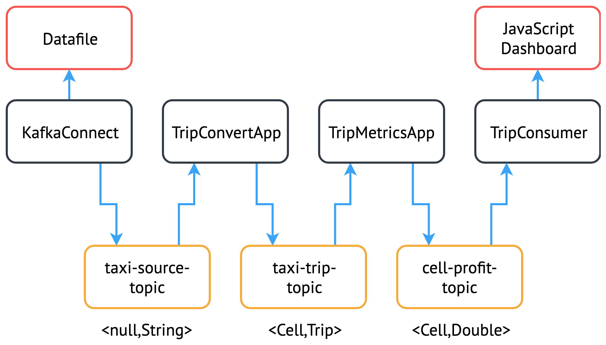

# Taxi Dataset Demo

A sample application using the NYC taxi dataset, also used in the DEBS 2015 Grand Challenge.

The deployment has the following application structure:

<p align=center>
  
</p>

For a more detailed discussion of the implementation details please [follow the link here](doc/README.md).

## Building

To rebuild the docker containers with any changes, set the `USER` environment variable to the username of the docker hub account the images should be pushed to. If running the simple example, ensure `sorteddata.csv` ([source](<http://www.debs2015.org/call-grand-challenge.html>)) is located in [taxi-producer/src/main/resources](taxi-producer/src/main/resources). To build, simply run the following command from the root directory:

```bash
make all
```

## Deployment

The instructions here assume that you have setup your cluster appropriately, following the [strimzi quickstart documentation](<https://strimzi.io/quickstarts/>).

There are two separate application deployments, one using KafkaConnect, and the other using a separate docker image to feed in the data. YAML files have been provided for both OpenShift and Kubernetes, use `oc` or `kubectl` as appropriate (in the case of `kubectl` add `-n kafka` to each command also). For the simple deployment (without KafkaConnect), replace all occurrences of `oc-connect.yaml` or `kube-connect.yaml` with `oc.yaml` or `kube.yaml` respectively, and avoid the following sections - [Running the Python FTP server](https://github.com/adam-cattermole/strimzi-lab/tree/add-taxi-example/taxi-example#running-the-python-ftp-server), [Start the Taxi Connector](https://github.com/adam-cattermole/strimzi-lab/tree/add-taxi-example/taxi-example#start-the-taxi-connector), and [Delete the Taxi Connector](https://github.com/adam-cattermole/strimzi-lab/tree/add-taxi-example/taxi-example#delete-the-taxi-connector).

### Running the Python FTP server

Install `pyftpdlib`:

```bash
pip install pyftpdlib
```

Create a folder at `ftp-server/taxi-data`, and add the `sorteddata.csv` file ([source](<http://www.debs2015.org/call-grand-challenge.html>)).

Run the server:

```bash
cd ftp-server
sudo python ftp-server.py
```

### Deploy the Demo on OpenShift

To deploy the application, adjust the image names in [deployment/oc-connect.yaml](deployment/oc-connect.yaml) appropriately, or leave unchanged for the default images.

```bash
oc create -f deployment/oc-connect.yaml
```

#### Start the Taxi Connector

Once the connect image is running and listening at the endpoint, and the FTP server is hosting the file, you can deploy the connector to start streaming data:

`connect.ftp.address` should be set to the IP address of the FTP server.

`connect.ftp.filepath` should be set to the path of the file to be read, from the root of the FTP server.

``` bash
oc exec -i my-cluster-kafka-0 -- curl -s -X POST \
    -H "Accept:application/json" \
    -H "Content-Type:application/json" \
    http://my-connect-cluster-connect-api:8083/connectors -d @- <<'EOF'

{
    "name": "taxi-connector",
    "config": {
        "connector.class": "io.strimzi.TaxiSourceConnector",
        "connect.ftp.address": "<ip-address>",
        "connect.ftp.user": "strimzi",
        "connect.ftp.password": "strimzi",
        "connect.ftp.filepath": "sorteddata.csv",
        "connect.ftp.topic": "taxi-source-topic",
        "tasks.max": "1",
        "value.converter": "org.apache.kafka.connect.storage.StringConverter"
    }
}
EOF
```

#### Delete the Taxi Connector

First stop the connector:

```bash
oc exec -i my-cluster-kafka-0 -- curl -s -X DELETE \
    http://my-connect-cluster-connect-api:8083/connectors/taxi-connector
```

#### Remove

Delete the resources:

```bash
oc delete -f deployment/oc-connect.yaml
```

Once completed delete all topics:

```bash
oc delete kafkatopic --all
```