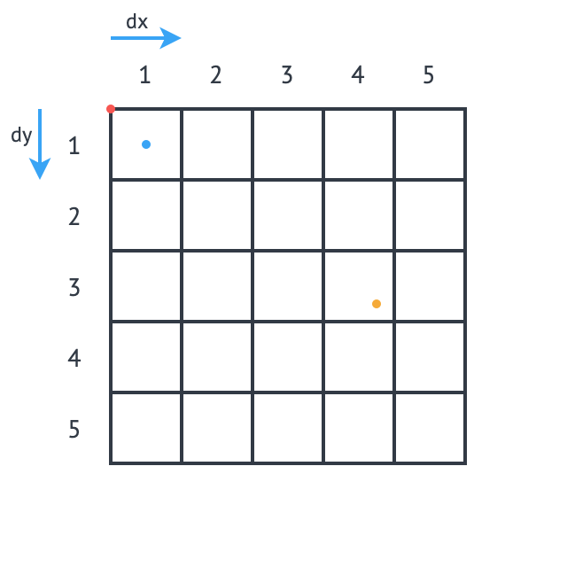

# Building a Kafka Streams Application

Within this article we describe the steps required to get started with building your own Kafka Streams application on top of Strimzi. We start with a simple example and build upon it to create a multi-stage pipeline, performing some operations on the data stream and visualising at the consumer.

## Dataset/Problem

The data we have chosen for this example is New York City taxi journey information from 2013, which was the dataset for the [Distributed Event Based Systems (DEBS) Grand Challenge in 2015](http://www.debs2015.org/call-grand-challenge.html). For a description of the source of the data, see [the article here](<https://chriswhong.com/open-data/foil_nyc_taxi/>).

The dataset is provided as a CSV file, with the columns detailed below:

| Column              | Description                                             |
| ------------------- | ------------------------------------------------------- |
| `medallion`         | an md5sum of the identifier of the taxi - vehicle bound |
| `hack_license`      | an md5sum of the identifier for the taxi license        |
| `pickup_datetime`   | time when the passenger(s) were picked up               |
| `dropoff_datetime`  | time when the passenger(s) were dropped off             |
| `trip_time_in_secs` | duration of the trip                                    |
| `trip_distance`     | trip distance in miles                                  |
| `pickup_longitude`  | longitude coordinate of the pickup location             |
| `pickup_latitude`   | latitude coordinate of the pickup location              |
| `dropoff_longitude` | longitude coordinate of the drop-off location           |
| `dropoff_latitude`  | latitude coordinate of the drop-off location            |
| `payment_type`      | the payment method - credit card or cash                |
| `fare_amount`       | fare amount in dollars                                  |
| `surcharge`         | surcharge in dollars                                    |
| `mta_tax`           | tax in dollars                                          |
| `tip_amount`        | tip in dollars                                          |
| `tolls_amount`      | bridge and tunnel tolls in dollars                      |
| `total_amount`      | total paid amount in dollars                            |

*source: DEBS 2015 Grand Challenge*

There are several different interesting avenues that could be explored within this dataset, for example:

- We could follow specific taxis to calculate the takings from one taxi throughout the course of a day, or calculate the distance from their last drop off to the next pickup to find out whether they are travelling far without a passenger
- By using the distance and time of the taxi trip we could calculate the average speed, and use the coordinates of the pickup and dropoff to try to guess the amount of traffic encountered

We have picked a relatively simple example, where we can calculate the total amount of money (`fare_amount + tip_amount`) taken, based off of the pickup location of the journey. This involves splitting the input data into a grid of different cells, and summing the total amount of money taken for every journey that originates from any cell. To do this we have to consider splitting up processing in a way that ensures the correctness of our output.

We will build this example up step-by-step, starting with KafkaConnect and the Strimzi built-in `FileStreamSourceConnector`.

## Strimzi Setup

Follow the current [Strimzi quickstart documentation](<https://strimzi.io/quickstarts/>) to get the Kafka cluster deployed.

## Getting Data into the System

First things first, we need to make our dataset accessible from the cluster.

Next we have to deploy KafkaConnect to our cluster using the cluster operator, describe in the [Strimzi documentation here](<https://strimzi.io/docs/latest/#kafka-connect-str>). KafkaConnect is exposed as a RESTful resource, and so to create a new Connector we can `POST` the following. This creates a new `FileStreamSourceConnector`, pointing at the volume containing our data file, exporting it to our new KafkaTopic `taxi-source-topic`.

```bash
curl -X POST ...
```

We can check that the data is streaming correctly by consuming events from the topic:

```bash
oc run kafka-consumer -ti --image=strimzi/kafka:0.11.1-kafka-2.1.0 --rm=true --restart=Never -- bin/kafka-console-consumer.sh --bootstrap-server my-cluster-kafka-bootstrap:9092 --topic taxi-source-topic --from-beginning
```

## Kafka Streams Operations on the Data

Now that we have confirmed that the `String` data is present in the system, we can start to perform operations on the data. To start with, we need to configure the Kafka client with several different options - these are provided through use of the [TripConvertConfig.java???](). Some configuration is passed in from the deployment YAML using environment variables, so that this is abstracted away from the application logic. For each new application that we develop we use the same method for providing configuration. Lets create the config options using this first:

```java
TripConvertConfig config = TripConvertConfig.fromEnv();
Properties props = TripConvertConfig.createProperties(config);
```

The KafkaStreams we have defined follow the same pattern, where we read from one KafkaTopic, perform some kind of operation on the data, and sink to another output KafkaTopic. Lets start by creating the source KafkaStream object, and define the SerDes (Serialisation/Deserialisation) for consuming data from this topic:

```java
StreamsBuilder builder = new StreamsBuilder();
KStream<String, String> source = builder.stream(config.getSourceTopic(), Consumed.with(Serdes.String(), Serdes.String()));
```

To perform any operations on the data, we need to convert the `<String, String>` (`<key, value>`) events into the type we require. We have created a Plain Old Java Object (POJO) representing the `Trip` data type, along with the `enum TripFields` representing the column of each data element. We provide a function `constructTripFromString` to take these CSV lines and convert them into this data type. The Kafka Streams DSL makes it easy to map over the events to convert to the type we require:

```java
KStream<String, Trip> mapped = source
                .map((key, value) -> {
                		new KeyValue<>(key, constructTripFromString(value))
                });
```

We could then write the output rom this operation to the sink topic, however the SerDes we use has changed for the value field. We require a method of performing this sort of operation on the custom data type we have created. This is where the [JsonObjectSerde.java??]() class comes into play. We are using the [Vertx JsonObject](<https://vertx.io/docs/apidocs/io/vertx/core/json/JsonObject.html>) implementation, and including our class type in the constructor to save us doing the hard work, although a different implementation may be better suited to your application. The original `Trip` type only needs adjusting with appropriate `@JsonCreator` and `@JsonProperty` annotations. We are now ready to output to our KafkaTopic with the following:

```java
final JsonObjectSerde<Trip> tripSerde = new JsonObjectSerde<>(Trip.class);
mapped.to(config.getSinkTopic(), Produced.with(Serdes.String(), tripSerde));
```

### Application Specific Information

We wanted to calculate profitability of a particular cell by calculating which cell a particular journey originates from. This requires us to perform some calculations given the latitude and longitude of a `Trip`. We use the logic laid out in the DEBS Grand Challenge for defining the specifics of the grid. See the figure below for an example.

We use an origin point (blue point in the figure) representing the centre of the grid cell (1,1), and a size in metres of each cell in the grid. The cell size is converted into a latitude and longitude distance, `dy` and `dx` respectively, and the position of the top left of the grid is calculated (red point), which allows us to easily count how many of this distance away the incoming coordinates are, and therefore that it originates from cell (3,4).



The additional application logic in the [Cell.java???]() class and [TripConvertApp.java???]() perform this calculation, and we set the key of the new records as the `Cell` type, using a new SerDes created in an identical fashion to that of the `tripSerde`. This is important to ensure that every `Trip` corresponding to a particular pickup `Cell` are distributed to the same partition, and in turn the same processing node will receive this event, ensuring correctness and reproducability of the operations.

## Aggregation

Now that we have data arriving as type `<Cell, Trip>` we would like to perform an aggregation operation. To keep things simple, we intend to calculate the sum of the `fare_amount + tip_amount` for every journey originating from one pickup cell within a set time period.

The first thing we need is to create a class that implements `TimestampExtractor`, which we can set in our configuration, as we want our time windows to be based on the time included in the events, instead of the time they entered the system. See the implementation in [TripTimestampExtractor.java???]() for details.


```java
KStream<Cell, Trip> source = builder.stream(config.getSourceTopic(), Consumed.with(cellSerde, tripSerde));
KStream<Windowed<Cell>, Double> windowed = source
        .groupByKey(Serialized.with(cellSerde, tripSerde))
        .windowedBy(TimeWindows.of(TimeUnit.MINUTES.toMillis(15)))
        .aggregate(
                () -> (double) 0,
                (key, record, profit) -> {
                    profit + record.getFareAmount() + record.getTipAmount()
                },
                Materialized.<Cell, Double, WindowStore<Bytes, byte[]>>as("profit-store")
                        .withValueSerde(Serdes.Double()))
        .toStream();
```


- groupbykey
- window
- why materialized
- output to new topic

## Consume and Visualise

- vertx eventbus
- stream to sockjs
- output events to dashboard log
- draw grid using leaflet
- calculate opacity out of arbitrary value
- set map cell opacity style

## References

[1]: http://www.debs2015.org/call-grand-challenge.html	"DEBS 2015 Grand Challenge"


